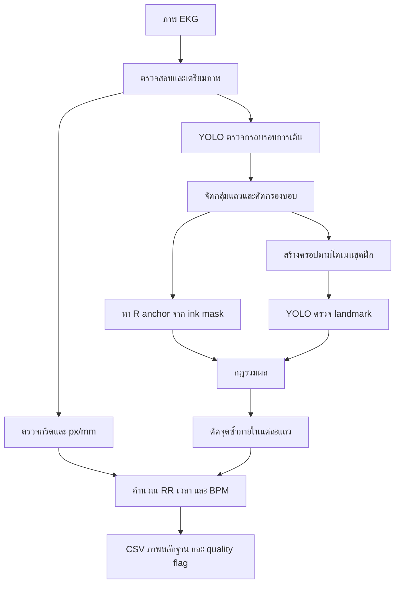

# บทที่ 3 วิธีดำเนินการวิจัย

## 3.1 รูปแบบการวิจัย

งานวิจัยนี้เป็นการวิจัยและพัฒนา (research and development) ด้านการประมวลผลภาพทางชีวการแพทย์ มีวัตถุประสงค์เพื่อพัฒนาระบบตรวจหาตำแหน่งยอดคลื่นอาร์จากภาพคลื่นไฟฟ้าหัวใจบนกระดาษ และใช้ตำแหน่งดังกล่าวคำนวณช่วงอาร์–อาร์ (RR interval) กับอัตราการเต้นของหัวใจ ระบบใช้แบบจำลองการเรียนรู้เชิงลึกร่วมกับการประมวลผลภาพเชิงกำหนดกฎ เพื่อให้ยังสามารถประมาณตำแหน่งได้เมื่อแบบจำลองจุดไม่ให้ผล และสามารถตรวจสอบเหตุผลของผลลัพธ์ย้อนหลังได้

การดำเนินงานแบ่งเป็น 4 ระยะ ได้แก่ (1) วิเคราะห์ข้อมูลและข้อจำกัดของภาพจริง (2) ออกแบบและพัฒนาไปป์ไลน์ (3) ทดลองเปรียบเทียบวิธีเตรียมภาพ รูปแบบครอป และเกณฑ์รวมผล และ (4) ประเมินความถูกต้อง ความทนทาน และความสามารถในการทำซ้ำ

## 3.2 กรอบแนวคิด

สมมติฐานเชิงระบบคือ การแบ่งปัญหาออกเป็นการตรวจหาบริเวณ การหาจุดอ้างอิงจากหมึก การปรับละเอียดด้วยแบบจำลอง landmark และการสอบเทียบกริด จะทนต่อเส้นจาง กริดรบกวน และความต่างโดเมนได้ดีกว่าการพึ่งแบบจำลองเดียว

ตัวแปรต้นประกอบด้วยวิธีเตรียมภาพ ค่า confidence และ IoU วิธีสร้างครอป เกณฑ์หน้ากากหมึก และเกณฑ์ยอมรับจุดจากแบบจำลอง ตัวแปรตามประกอบด้วย precision, recall, F1-score ความคลาดเคลื่อนของตำแหน่ง ความคลาดเคลื่อนของ RR/BPM จำนวนจุดซ้ำ จำนวนผลที่ถูกปฏิเสธ และจำนวนรายการที่ต้องตรวจสอบ

## 3.3 ข้อมูลและค่าจริงอ้างอิง

หน่วยข้อมูลพื้นฐานคือภาพคลื่นไฟฟ้าหัวใจหนึ่งภาพ ซึ่งอาจมีหลายแถว หน่วยประเมินแบ่งเป็นระดับภาพ ระดับแถว ระดับรอบการเต้น และระดับคู่ของยอด R ที่ติดกัน การรายงานต้องระบุจำนวนตัวอย่างทุกระดับ เพราะรอบการเต้นภายในภาพหรือสัตว์เดียวกันไม่เป็นอิสระต่อกัน

ภาพรับเข้าต้องถอดรหัสได้ มีบริเวณคลื่นที่วิเคราะห์ได้ และมีความละเอียดเพียงพอให้ผู้เชี่ยวชาญระบุยอด R เกณฑ์คัดออก ได้แก่ ไฟล์เสียหาย ภาพไม่มีคลื่นที่เกี่ยวข้อง ถูกตัดจนกำหนดลำดับไม่ได้ หรือไม่มีข้อมูลอ้างอิงสำหรับตัวชี้วัดที่ศึกษา

ค่าจริงอ้างอิงควรกำหนดโดยผู้ประเมินที่มีความรู้ด้านคลื่นไฟฟ้าหัวใจ โดยระบุรหัสภาพ หมายเลขแถว ลำดับยอด พิกัด x–y สถานะความแน่นอน และรหัสผู้ประเมิน หากมีผู้ประเมินหลายคน ต้องให้ฉลากอย่างอิสระและหาข้อยุติในรายการที่ไม่ตรงกัน พร้อมรายงานความสอดคล้องระหว่างผู้ประเมิน

การแบ่ง train, validation และ test ต้องแบ่งในระดับสัตว์หรือแหล่งข้อมูล ไม่แบ่งในระดับรอบการเต้น เพื่อป้องกันข้อมูลจากสัตว์เดียวกันรั่วไหลข้ามชุด ชุดทดสอบต้องไม่ถูกใช้เลือก preprocessing หรือพารามิเตอร์

ข้อมูลใน `data/` ถือเป็นข้อมูลอ่อนไหว ต้องลดการระบุตัวตน จำกัดสิทธิ์ สำรอง และกำหนดระยะเก็บรักษา วิทยานิพนธ์ฉบับจริงต้องระบุแหล่งข้อมูล ช่วงเวลา เลขรับรองจริยธรรม และกระบวนการยินยอมตามข้อเท็จจริง

## 3.4 เครื่องมือ

ระบบใช้ Python, OpenCV และ NumPy สำหรับภาพ ใช้ Ultralytics YOLO และ PyTorch สำหรับแบบจำลอง ใช้ FastAPI/Uvicorn เป็นบริการเว็บ และ pytest สำหรับทดสอบ Docker แยกสภาพแวดล้อมทดสอบ อนุมาน และเว็บ การทดลองทุกครั้งต้องบันทึกรุ่นระบบปฏิบัติการ Python ไลบรารี ฮาร์ดแวร์ Git commit ค่า hash ของน้ำหนัก และค่าทั้งหมดใน `Config`

หลักการทำงาน ประวัติการพัฒนา และรายละเอียดสถาปัตยกรรม YOLO11 อธิบายเพิ่มเติมใน [[09 - พื้นฐานและวิวัฒนาการของ YOLO]]

## 3.5 ขั้นตอนพัฒนาระบบ

### 3.5.1 การรับและเตรียมภาพ

ระบบรองรับ JPEG/PNG ตรวจชนิดจากการถอดรหัสจริง และจำกัดพาธให้อยู่ในโฟลเดอร์ข้อมูล ภาพถูกแปลงด้วยหนึ่งในวิธี `blackhat`, `blackhat_otsu`, `tophat_gray`, `tophat_red`, `adaptive`, `ink` หรือ `red` อาจใช้ hysteresis เพื่อเชื่อมปลายยอดจางเข้ากับแกนหมึก ใช้ closing เชื่อมช่องว่าง และ dilation เพิ่มความหนา วิธีดำเนินการของแต่ละวิธีและผลการเปรียบเทียบอยู่ใน [[10 - ผลการทดลอง Preprocessing]]

การเปลี่ยน preprocessing ถือเป็นการเปลี่ยนโดเมนของแบบจำลอง จึงต้องประเมินทั้ง recall ของกรอบ ผลบวกลวง รูปร่างกรอบ และผลต่อ RR/BPM ไม่ตัดสินจากความชัดด้วยสายตาเพียงอย่างเดียว

### 3.5.2 การตรวจกรอบและจัดกลุ่มแถว

แบบจำลอง YOLO ขั้นแรกตรวจกรอบของแต่ละรอบการเต้นด้วยค่า confidence, IoU และ `imgsz` ที่กำหนด กรอบถูกจัดกลุ่มตามตำแหน่งกึ่งกลางแนวตั้งโดยเทียบกับมัธยฐานความสูง แล้วเรียงซ้ายไปขวาภายในแต่ละแถว เพื่อห้ามคำนวณ RR ข้าม lead

ระยะ row pitch คำนวณจากมัธยฐานของระยะระหว่างจุดกึ่งกลางกรอบ กรอบหัว–ท้ายแถวที่อาจเป็น calibration pulse หรือเศษภาพถูกตรวจด้วยแอมพลิจูด ความกว้างยอด ความกว้างกล่อง และตำแหน่งยอด โดยบันทึกจำนวนที่ตัดออกเพื่อประเมินความผิดพลาด

### 3.5.3 การสร้าง ink mask และ R anchor

หน้ากากหมึกใช้ความสว่างร่วมกับ saturation เพื่อแยกเส้นคลื่นสีดำจากกริดสีแดง มีการปรับเพดานความสว่างอัตโนมัติ ตัดคอลัมน์รบกวน เก็บองค์ประกอบเชื่อมต่อที่สัมพันธ์กับเส้นหลัก และกำหนดความต่อเนื่องขั้นต่ำของหมึก

ระบบขยายกรอบค้นหาทั้งแนวนอนและแนวตั้ง เพราะกรอบจากภาพ threshold อาจตัดปลายยอดจาง จากนั้นประมาณแนวฐาน วัดระยะเบี่ยงเบนของหมึก และเลือก excursion เด่น รองรับทั้งยอดชี้ขึ้นและลง จุดนี้เรียกว่า anchor หากหาไม่ได้จึงใช้กึ่งกลางกรอบเป็น fallback และต้องบันทึกเป็นกรณีตรวจสอบ

### 3.5.4 การสร้างครอป

โหมดหลัก `train_match` กำหนดความกว้างจาก row pitch ความสูงจากแอมพลิจูด และวาง R ตามสัดส่วนที่วัดจากชุดฝึก โหมดทดลองอื่น ได้แก่ `mm`, `anchored`, `height`, `pitch`, `box` และ `stretch`

เมื่อครอปเกินขอบภาพ ระบบคงขนาดกรอบแล้วเติมขอบ แทนการย่อกรอบจนสเกลเปลี่ยน ทุกครอปถูก resize เป็นขนาดคงที่และบันทึกตำแหน่งต้นทาง ระยะ padding และสเกลแกน x/y แยกกัน เพื่อแปลงพิกัดกลับสู่ภาพต้นฉบับ

### 3.5.5 การตรวจ landmark และการรวมผล

YOLO ขั้นที่สองตรวจ landmark หลายคลาส P/Q/R/S/T ระบบเลือกเฉพาะคลาส R ตาม `r_class_id` แต่เก็บคลาสอื่นเพื่อแสดงหลักฐาน การประมวลผลทำเป็น batch

anchor เป็นค่าตั้งต้น และใช้จุดแบบจำลองแทนเมื่อ (1) อยู่ในระยะ `max_refine_ratio × row pitch` จาก anchor หรือ (2) มี confidence ไม่น้อยกว่า `trust_model_conf` หากอยู่ไกลและไม่มั่นใจ ระบบปฏิเสธจุดนั้น กรณีไม่มีโมเดลจุด ระบบยังทำงานด้วย anchor ได้ ทุกยอดต้องระบุ `src=model` หรือ `src=anchor`

### 3.5.6 การตัดจุดซ้ำ

ครอปที่ซ้อนกันอาจทำนาย landmark เดียวหลายครั้ง ระบบรวม landmark ที่อยู่แถวและคลาสเดียวกันภายในระยะกำหนด โดยเก็บตัวที่มั่นใจสูงกว่า ยอด R ขั้นสุดท้ายถูกตัดซ้ำด้วยระยะต่ำสุดที่เป็นสัดส่วนของมัธยฐาน RR เสมือน refractory period เชิงภาพ

## 3.6 การสอบเทียบและคำนวณ

ระบบประมาณพิกเซลต่อมิลลิเมตรจากคาบกริด และใช้เส้นหลัก 5 มิลลิเมตรหลายเส้นเพื่อ refine แบบจำลองคาบ พร้อมบันทึก residual และ drift เมื่อมีจุดกำเนิด $x_0$ และสเกล $s$:

$$x_{mm}=\frac{x_{px}-x_{0,px}}{s_{px/mm}}$$

สำหรับยอดติดกันภายในแถวเดียวกัน:

$$RR_{mm,i}=\frac{x_{i+1}-x_i}{s_{px/mm}},\quad RR_{s,i}=\frac{RR_{mm,i}}{v},\quad HR_i=\frac{60}{RR_{s,i}}$$

โดย $v$ คือความเร็วกระดาษ ระบบสรุปจำนวน ค่าเฉลี่ย ส่วนเบี่ยงเบนมาตรฐาน มัธยฐาน ต่ำสุด และสูงสุดต่อแถว และตรวจความสมเหตุสมผลของสเกลจาก HR ที่อนุมานได้

## 3.7 การออกแบบการทดลอง

ดำเนินการทดลองอย่างน้อย 5 ชุด ได้แก่

1. เปรียบเทียบ preprocessing โดยตรึงน้ำหนักและพารามิเตอร์อื่น
2. เปรียบเทียบ crop modes โดยวัดผลหลัง map กลับภาพจริง
3. Ablation study: `anchor_only`, `model_only` และ `hybrid`
4. Sensitivity analysis ของ confidence, refine ratio, trust threshold และ ink parameters
5. Domain robustness แยกตามแหล่งสแกน ความละเอียด ความเข้มกริด ชนิดสัตว์ และจำนวนแถว

ทุกการทดลองต้องบันทึก dataset, baseline, variant, configuration, box/peak metrics, RR/BPM error, จำนวน flag และผลตรวจด้วยมนุษย์ เลือกพารามิเตอร์จาก validation เท่านั้น

## 3.8 ตัวชี้วัด

จับคู่ยอดทำนายกับค่าจริงแบบหนึ่งต่อหนึ่ง ภายในแถวเดียวกันและ tolerance ที่กำหนดล่วงหน้า โดยรายงาน tolerance ทั้งพิกเซลและมิลลิเมตร

$$Precision=\frac{TP}{TP+FP},\quad Recall=\frac{TP}{TP+FN}$$

$$F1=2\frac{Precision\times Recall}{Precision+Recall}$$

รายงาน localization error ของแกน x และ Euclidean distance ด้วยค่าเฉลี่ย มัธยฐาน ส่วนเบี่ยงเบนมาตรฐาน เปอร์เซ็นไทล์ 95 และค่าสูงสุด สำหรับ RR/BPM รายงาน MAE, RMSE, bias, ช่วงความเชื่อมั่น และ Bland–Altman limits of agreement ตามความเหมาะสม

ช่วงความเชื่อมั่นควร bootstrap ในระดับสัตว์หรือภาพ ไม่สุ่มแต่ละรอบอย่างอิสระ การเปรียบเทียบวิธีบนภาพเดียวกันเป็นข้อมูลแบบจับคู่ จึงใช้ paired test หรือแบบจำลอง repeated measures; หากข้อมูลไม่ปกติอาจใช้ Wilcoxon signed-rank และใช้ McNemar สำหรับผลสำเร็จ/ล้มเหลว พร้อมปรับ multiple comparisons

## 3.9 การวิเคราะห์ข้อผิดพลาด

จำแนกความผิดพลาดเป็น crop miss, false crop, กรอบตัดยอด, anchor ถูกกริดรบกวน, landmark ผิดคลาส/ผิดรอบ, fusion ยอมรับหรือปฏิเสธผิด, dedup ผิด, grouping ผิด, scale/grid ผิด และภาพไม่เพียงพอ แต่ละหมวดต้องรายงานจำนวน สัดส่วน ตัวอย่าง และเพิ่ม regression test เมื่อแก้ไข

## 3.10 การประกันคุณภาพและการทำซ้ำ

ใช้ภาพสังเคราะห์ควบคุม px/mm ความจาง กริด จำนวน lead ยอดกลับทิศ และขอบภาพ ใช้โมเดลจำลองทดสอบกรณีตอบปกติ เงียบ ชี้ผิด และซ้ำ ก่อนเผยแพร่ต้องรัน unit tests, web/API tests, integration tests ด้วยน้ำหนักจริง ประเมินชุด test ที่กันไว้ ตรวจ overlay/flag และทดสอบการคืนผลหลัง restart

แต่ละ run ต้องบันทึก Git commit และ dirty state, manifest ข้อมูล, checksum ภาพและน้ำหนัก, class map, `Config` ทุกฟิลด์, runtime versions, ฮาร์ดแวร์, JSON/CSV และภาพหลักฐาน เพื่อให้ทำซ้ำและตรวจสอบย้อนกลับได้

## 3.11 เกณฑ์ยอมรับและข้อจำกัด

ต้องกำหนดเกณฑ์ขั้นต่ำของ recall, precision, localization error, RR/BPM error, อัตราภาพที่สำเร็จ และอัตราที่ต้องให้มนุษย์ตรวจ ก่อนเปิดผลชุดทดสอบ ระบบนี้เป็นเครื่องมือวิเคราะห์ภาพเชิงวิจัย ไม่ใช่ระบบวินิจฉัย และต้องแสดงแหล่งที่มาของจุด ภาพหลักฐาน quality flag และคำเตือนเมื่อมาตราส่วนไม่สมเหตุสมผล

> **ข้อมูลที่ต้องเติมในวิทยานิพนธ์ฉบับสมบูรณ์:** จำนวนประชากรและกลุ่มตัวอย่าง วิธีคำนวณขนาดตัวอย่าง แหล่งและช่วงเวลาเก็บข้อมูล เลขรับรองจริยธรรม คุณสมบัติผู้ให้ฉลาก ค่า tolerance เกณฑ์ยอมรับ แผนสถิติ และผลการทดลองจริง ห้ามสร้างข้อมูลเหล่านี้จากสมมติฐานของซอร์สโค้ด
