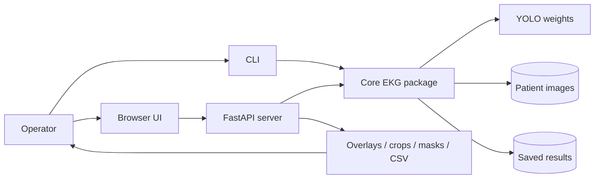
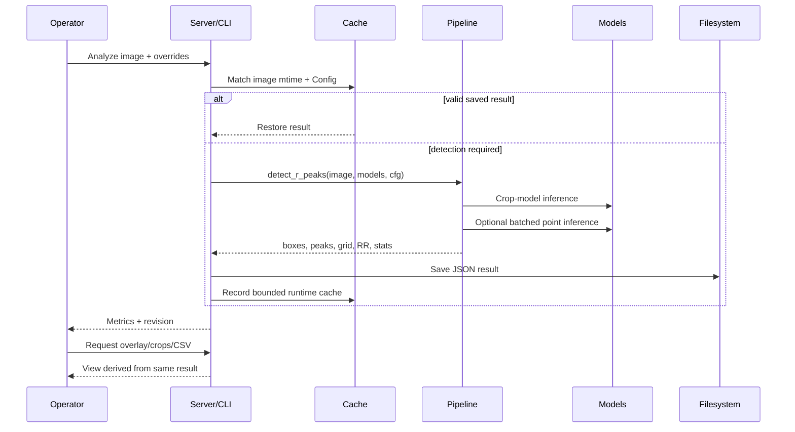

# Overall Framework

## System context

## Architectural layers

### 1. Input and registry

`imageio.py` reads Unicode paths and enumerates supported images. `patients.py` owns patient identifiers, metadata, patient folders, image addition/deletion, and migration of older flat datasets. `importer.py` imports external trees shaped like `<group>/<id name>/<crop>`.

### 2. Configuration

`Config` is the single configuration object passed throughout the core. CLI arguments and a restricted web override allowlist create modified immutable-style copies through `cfg.with_(...)`. Model preprocessing, geometry, thresholds, scale, and quality rules live here.

### 3. Detection engine

`pipeline.py` coordinates models and deterministic algorithms. It loads models lazily, detects boxes, groups rows, trims non-beats, builds crops, runs point detection in batches, chooses final peaks, and returns a structured result.

### 4. Measurement engine

`scale.py` estimates pixels per millimeter. `grid.py` detects major lines, refines their positions, establishes an x origin, and summarizes RR intervals. `export.py` converts results into stable tabular records and flags anomalous intervals.

### 5. Evidence and persistence

`render.py` draws source-linked evidence. `results.py` serializes numeric results and configuration without duplicating source images. A revision hash binds image identity, modification time, and configuration to browser-cache URLs.

### 6. Interfaces

The CLI supports batch and maintenance workflows. FastAPI supports interactive workflows and owns bounded in-memory caches. The browser is plain HTML/CSS/JavaScript, so there is no frontend compiler or dependency tree.

### 7. Deployment

The multi-stage Dockerfile separates lightweight tests, runtime ML dependencies, and the web image. Compose mounts weights read-only and data/output as persistent volumes. Production deployment adds Caddy for TLS and optional authentication.

## End-to-end sequence

## Key boundaries

- Core algorithms do not depend on FastAPI.
- Ultralytics is imported lazily, allowing most tests to use fake models without Torch.
- The web server is designed for one machine and does not isolate cache state by user session.
- Source images remain the system of record; saved results are invalidated if an image changes.
- The point model is optional, but the crop model is required for normal detection.

